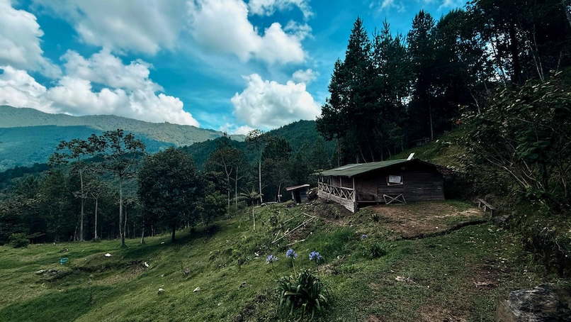
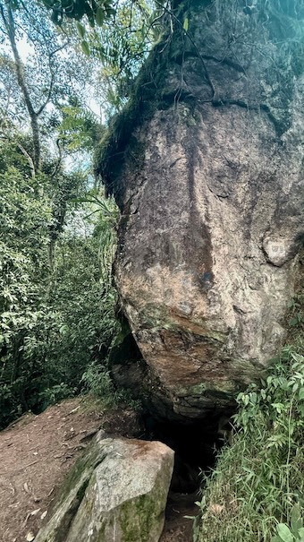
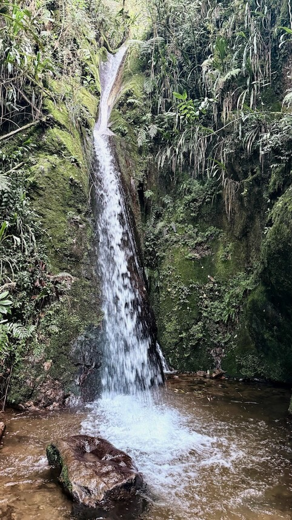
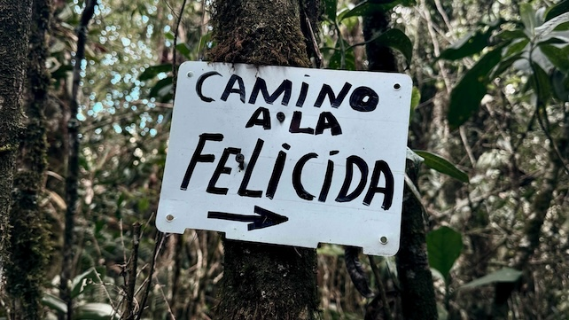
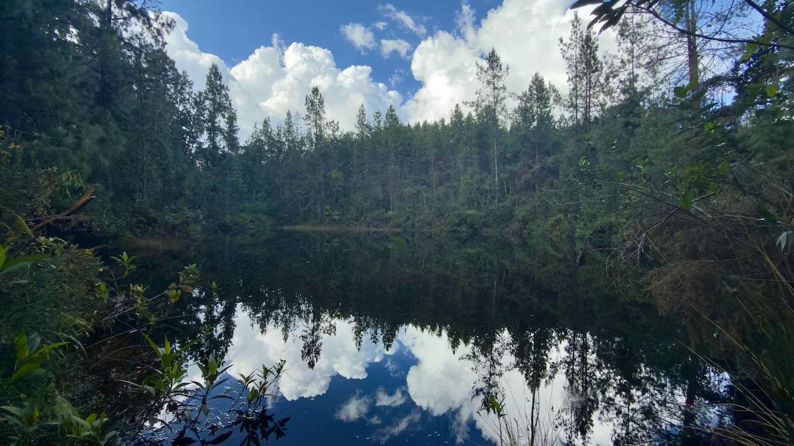

Sometimes the best adventures are the ones you decide to do when it's already "a bit late." And that's exactly what I did that day: set out at noon toward Laguna de Normandía.

<!--more-->

## The Decision

It was noon when I looked at the [Wikiloc](https://es.wikiloc.com/rutas-senderismo/camino-verde-cuevas-del-higueron-lago-alto-escobero-64056895) map and saw the route: 9 hours estimated, over 1,200 meters of elevation gain. Common sense said "leave it for another day, it's late." But something inside me said otherwise.

I calculated the times. I knew it wouldn't be easy. I knew I'd have to move fast. But I also knew I could try, checking hour by hour how I was feeling, and giving myself the option to turn back if necessary.

So I packed my backpack and headed out from Camino Verde in Envigado toward Laguna de Normandía.

## The Ascent

### Camino Real La Ayurá

The first kilometers were intense. I've been living at this altitude and on this mountain for almost 3 months now, and I've been preparing myself to be able to climb and descend many kilometers in a day without suffering from my knees. I started jogging 3 km, an ascent of approximately 200 meters, relatively easy, until the entrance to Camino Real La Ayurá.

The trail is difficult at the beginning: mud, stones, and a steeper ascent, so I switched to walking. I crossed streams and saw many butterflies. I had never seen so many butterflies in my life: yellow ones, Monarchs, and some blue and black ones I had never seen before, called Altinote. Having seen so many butterflies and discovered these new species already made me feel that the outing had been worth it.

This part of the trail, up to Cascada del Diablo, is the most crowded, and you see groups of friends and couples climbing to exercise and refresh themselves.

### Las Cuevas del Higuerón

This time I wouldn't stop at Cascada del Diablo, where most people go, but rather I had Las Cuevas del Higuerón as my first goal, which I didn't know and was very curious about. Once past the first major waterfall on the trail, the number of people decreases, and for many minutes I didn't see anyone.

I was surprised by a cabin in a clearing on the mountain, where they offer restroom service for 1000 COP (0.25 USD), according to a sign I saw. When I passed by, there was no one there. After passing through it, resuming the trail, I took this photo at 1:14 pm.

It took me about 10 more minutes of climbing to reach Las Cuevas del Higuerón. These rock formations are impressive, and although I didn't stop for long, I took a moment to appreciate the magnitude of the nature surrounding me. I found myself alone there, listening to the sounds of the forest and my breathing.

Here I did a general check. Physically I felt good, emotionally very good. I had already seen a new butterfly species and discovered the caves for the first time. The forest felt calm, "friendly," and I was excited to reach the lagoon.

I took a couple of minutes to breathe, and continued.

### Cascada Las Golondrinas

I kept climbing, and the next reference point was Cascada Las Golondrinas. The sound of falling water accompanies you before you see it, and when it finally appears, it's a refreshing spectacle. The roar is very loud, and the waterfall is taller than it appears in the photo.

I had been going for an hour and a half since I left home, so I took the opportunity to stop and refresh myself. I took off almost all my clothes, put them aside, and got under the powerful stream of ice-cold water, which accelerated my pulse and excited me. The impact of the water is very hard on my back, and I burst out laughing. I saw myself from the outside and smiled inside.

After refreshing myself, I took my things, dried off a bit with a towel, got dressed again, and looked for a comfortable spot to eat some nuts I had in my backpack. No more than 5 minutes later, I was walking again.

### Camino a la Felicidad

After the refreshing stop at the waterfall, perhaps the most difficult part of the day began, both mentally and physically. The climb became steeper and more monotonous. More and more often I found myself looking at the map, calculating how much climbing time I had left, and resting briefly before resuming my pace.

However, I felt that every time my mind began to tire, something happened that filled me with happiness and encouraged me to continue. At one point I was surprised by what I then called a bird concert: around me sounded bird songs I had never heard before. I stood still, then walked very slowly and listened. I recorded a video pointing at the treetops, but I didn't see any.

An hour after resting at the waterfall, already quite high up, I reached a point marked as "Camino a la Felicida" (like that, without the "d"). It marks the entrance to a pine forest (not native to Colombia). Life's ironies: by that point, my legs were already very tired. The accumulated elevation gain was felt in every step. But I kept going. One foot in front of the other. Higher and higher. The air getting colder and lighter.

The trail was barely visible and confirmed I was on the right track when I saw a red ribbon on a tree, a sign that I was on the correct path. I had to sit down at one point, my quadriceps couldn't take anymore. I lay down on the natural mattress that forms under pine forests, and looked up. It was 2:45 pm and I calculated that I had at most an hour left to reach the Lagoon.

I knew I had to reach it; if not my legs, my mind would get me there. I looked at the map, and saw that if I was too tired, I could exit to Loma del Escobero and from there take a bus or taxi back home. That was my Plan B, in case I didn't feel strong enough to descend.

The trail continues until you exit the forest, and you reach a dirt road opened by a company that extracts wood from the forest. By that point I was near the highest point, and I saw signs indicating that I was near La Romera, Sabaneta.

## The Arrival

After 3 hours and 40 minutes of continuous ascent, I arrived. The silence, the stillness of the heights and the forest. The still, black water completely reflected the sky. The place seemed more beautiful than what I had seen in photos. It's a small lagoon, surrounded by pines, quite inaccessible, and from it flows a small stream that descends down the mountain.

**Laguna de Normandía. 2,822 meters above sea level.**

I sat on a rock, pulled out something to eat, and simply... breathed. I breathed the cold mountain air. I breathed the satisfaction of effort. I breathed the happiness of being exactly where I wanted to be.

## The Return

I couldn't stay long. I looked at the time, and decided that if I returned quickly, I would make it out of the forest before nightfall. I had to reach the beginning of "Camino a la Felicida," and from there I could decide whether to exit via Loma del Escobero, or continue the descent. I had climbed over 1,200 meters of elevation—now I had to descend them.

I started the descent alternating between jogging and fast walking. My legs protested but responded. The kilometers passed. The GPS showed progress. Daylight held... for now.

The adrenaline of running downhill and the happiness of achieving the goal kept me moving forward. I made it out of the forest just in time, with daylight still present. And I kept jogging until I reached home. Total: 22.3 kilometers, 5 hours and 23 minutes of movement, over 1,300 meters of elevation.

## Reflections

I had wanted to visit the lagoon for a long time, and I was drawn to the idea of walking there from my house. This was my longest and most intense outing so far. And it makes me incredibly happy to know that I can do it. That I have the mountain so close. That I can go out any day and, in just a few hours, be at almost 3,000 meters of altitude, surrounded by nature, by silence, by beauty.

I also enjoy spontaneity. Although I had been preparing myself to make this effort, I really enjoyed doing this hike on a day when I hadn't planned it. I liked pushing myself to go out, even though it wasn't the "perfect moment." I liked having flexibility, and ultimately achieving the goal. Even if I hadn't achieved it, I would have enjoyed the journey just the same.

The journey is more important than the destination, always. I could have reached the Lagoon from above, via other trails, but I would have deprived myself of the effort of climbing, and of every moment I spent alone, in the forest. I didn't want the trail to be shorter—quite the opposite. Rather than wishing for easy or short trails, I desire a body and mind that allow me to traverse the difficult and long ones.

It's not about proving anything to anyone, more than to myself. It's simply living, enjoying, experiencing, seeing, knowing. It's taking advantage of having the physical capacity, the time, and the privilege of having these mountains within reach.

Every step I took toward the lagoon was a reminder of why I love this. I enjoy these little "adventures" that refresh my mind and spirit. Every moment of tiredness was countered by moments of wonder. And every time my legs wanted to stop, my mind reminded them: "We came here for something. Let's keep going."

I'm already thinking about the next adventure. And training my legs to be able to enjoy it.

## Route Data

If you want to see the technical details of the route:

- **Route on Wikiloc**: [Cascada Las Golondrinas, Laguna de Normandía y Cuevas del Higuerón desde Vereda Chingui](https://es.wikiloc.com/rutas-senderismo/cascada-las-golondrinas-laguna-de-normandia-y-cuevas-del-higueron-desde-vereda-chingui-239459161)
- **Activity on Strava**: [Desde El Chingui hasta la Laguna de Normandía](https://www.strava.com/activities/16398627439)

**Statistics:**

- **Distance**: 22.3 km
- **Elevation gain**: 1,337 m  
- **Maximum altitude**: 2,822 m
- **Minimum altitude**: 1,644 m
- **Moving time**: 5h 23m
- **Total time**: ~7 hours (with breaks)

---

*If you're in Medellín or Envigado and enjoy hiking, this route is a beautiful challenge. Just make sure to start early—earlier than I did.*
